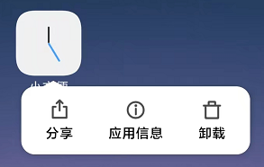

# 小方便APP生活工具

## 介绍
小方便APP生活工具，纯Android原生开发支持Android9.0系统以上。
 注意本项目仅开源Entity界面不开源核心代码！ 

## 食用方法

> 注意演示手机为MIUI12 Android操作系统 其它品牌手机操作大致都一样。

### 1、应用系统适配设置

首先找到我们安装好的应用，长按应用图标，点击应用信息。
  

然后你会进入如下的页面
  

点击通知管理进入如下界面
  

#### 重点来了！（设置提示）

我们APP应用所需的适配权限如下

* 悬浮通知权限（必选）
* 锁屏通知权限（可选）
* 发声权限 （必选）
* 震动权限 （必选）
* 呼吸灯闪烁权限 （可选）

以上设置是为了能够让程序正常的运行，如果不给予以上权限则无法及时收到通知。

### 2、应用省电策略 （非必要操作可选）

根据 > ( 1、应用系统适配设置 ) 操作进入到应用信息页面

接着点击省点策略，看到如下界面
  

* 此处我选择了无限制，默认是智能限制后台运行，这里改不改都可以，测试的时候是没有任何问题的如果你遇到了问题可以更改此项试试看。

### 3、列表应用界面介绍

首先我们进入到主界面，如下图
  

* 底部的菜单栏对应着每一个页面和对应的功能

接着我们点击右下角的蓝色圆圈里面有 “+” 的图标，进入到如下新建界面。
  

#### 新建基础操作
* 标题：是提示显示的标题
* 内容：是提示时显示的主内容可以为长文本
* 提示时间是必选
* 提醒方式有四种，第一种：指定日期提醒，第二种：指定日期重复提醒，第三种：周期提醒，第四种：每天都提醒
* 按各自所需选择即可

#### 如何编辑呢？
* 编辑你创建的提醒只需要你点击创建好的提醒列表即可跳转到编辑操作

#### 提醒状态识别
* 如果在列表里你的时间颜色为绿色则为运行中，反之则为已经结束

### 4、便签应用界面介绍

首先我们点击底部菜单的便签即可跳转到便签的列表，如下图。
  

接着我们点击右下角的蓝色圆圈里面有 “+” 的图标，进入到如下新建界面。
  

#### 新建基础操作
* 标题：是提示显示的标题
* 内容：是提示时显示的主内容可以为长文本
* 选择显示则在你的手机状态栏中一直常驻提示（详细可看最下方的提示展示图片）

#### 如何编辑呢？
* 编辑你创建的便签只需要你点击创建好的便签列表即可跳转到编辑操作

#### 提醒状态识别
* 如果在列表里你的时间颜色为绿色则为已在显示，反之则为关闭显示

### 提示展示图
  

## 最后

感谢你使用小方便APP，如果你在使用中遇到了BUG或其它原因我们会择机修复 ^-^

> WeiLin END
